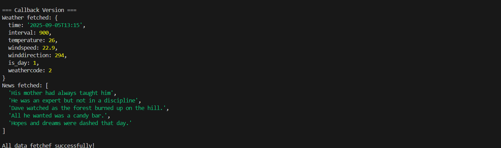
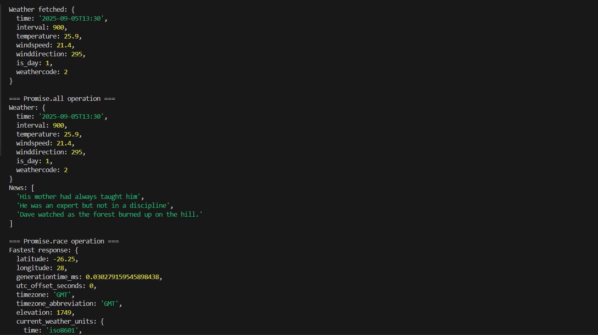
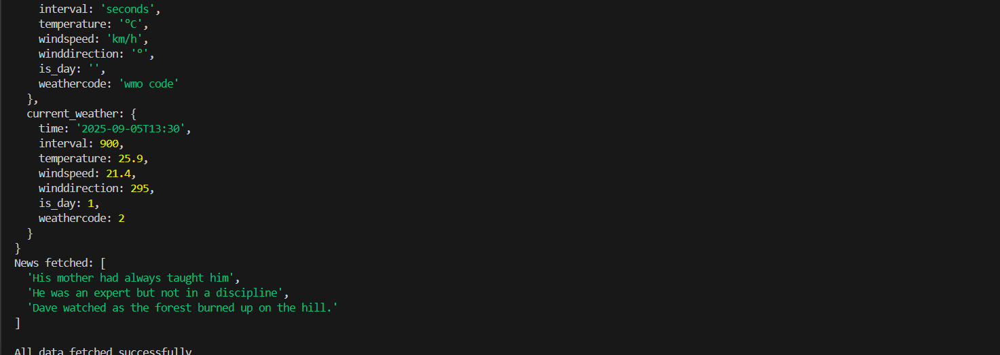
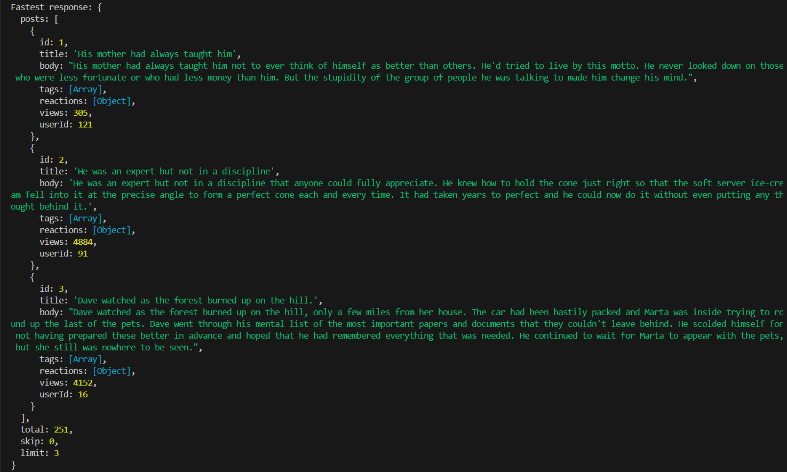
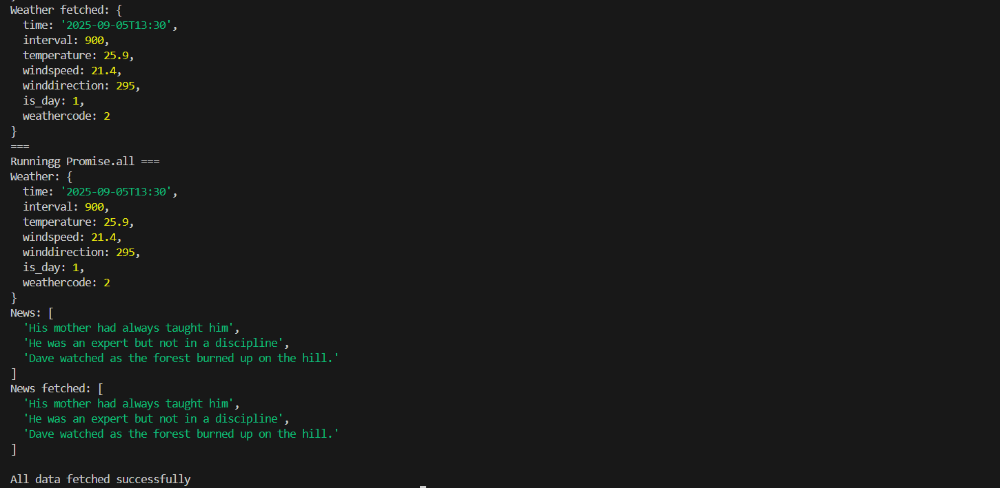

# async-weather-news-dashboard

An app that should fetch weather data and news headlines from public APIs, showcasing different asynchronous styles, namely: Callbacks, promises, and async/await.

## Core Features

- Fetch weather data (Open-Meteo API or any other weather API)
- Fetch news headlines (DummyJSON Posts API or any - other news API)
- Callback-based implementation
- Promise-based implementation
- Async/Await implementation
- Promise.all() → run weather + news requests simultaneously
- Promise.race() → get the fastest response

## How to run the program

- git clone https://github.com/Karabo5/async-weather-news-dashboard.git

- cd async-weather-news-dashboard

- npm init -y

- git checkout dev

## To run callbackVersion.ts

- npm run callback

## To run promiseVersion.ts

- npm run promise

## To run asyncAwaitVersion.ts

- npm run async

## Sample console outputs:

